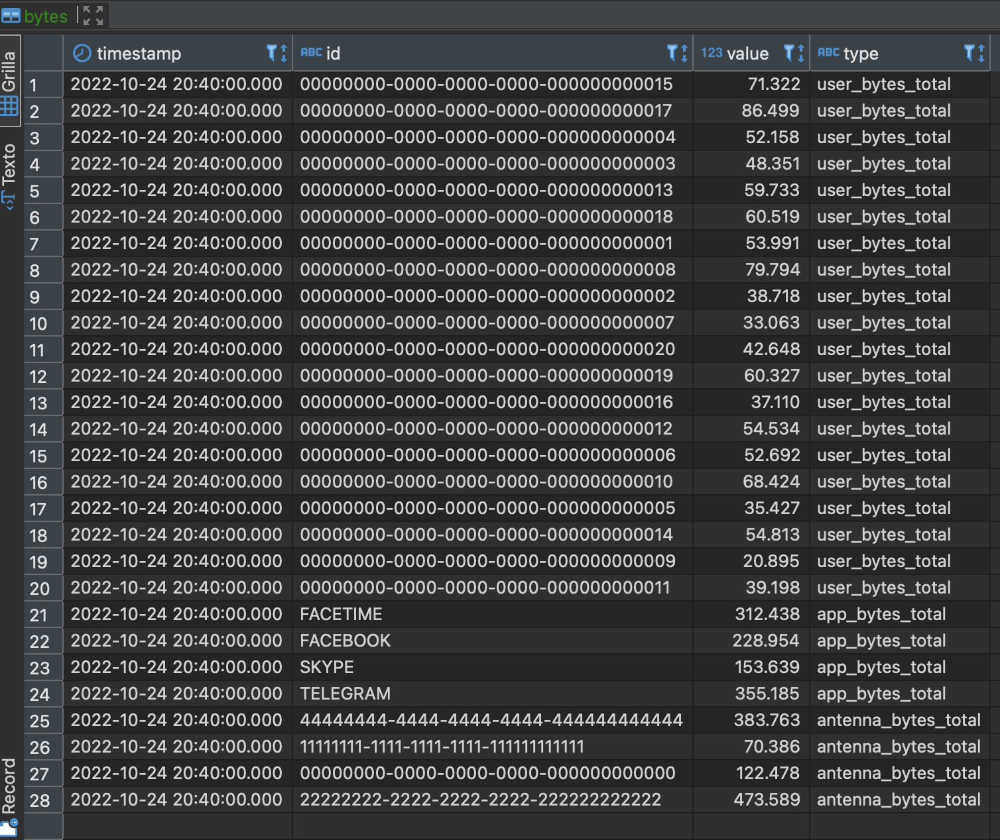

# Práctica Armando Bueno de Big Data Processing con Spark y Scala

En esta práctica se aborda el uso de SSS (Spark Structure Streaming) para recuperar información del uso de dispositivos de usuarios y un proceso Batch que se ejecuta cada hora para realizar otras operativas.

La información se recoge en un sistema Kafka que se encuentra alojado en una Máquina Virtual en Google Cloud Platform.

## Proceso de Streaming / Speed Layer

* Spark Structured Streaming, hace métricas agregadas cada 5 minutos y guarda en PostgreSQL.
    * Total de bytes recibidos por antena.
    * Total de bytes transmitidos por id de usuario. 
    * Total de bytes transmitidos por aplicación
* Spark Structured Streaming, también enviara los datos en formato PARQUET a un almacenamiento de google cloud storage, particionado por AÑO, MES, DIA, HORA.

## Batch Layer

Job de SparkSQL que calcula para un AÑO, MES, DIA, HORA, las métricas siguientes en base al servicio:
Todas las métricas son almacenadas en PostgreSQL.

### Un servicio de analíticas de clientes.
* Total de bytes recibidos por antena.
* Total de bytes transmitidos por mail de usuario.
* Total de bytes transmitidos por aplicación.
* Email de usuarios que han sobrepasado la cuota por hora.

## Capturas de la Base de datos

### Streaming Process

#### metadata

#### bytes

### Batch Process

#### user_metadata

#### bytes_hourly

#### user_quota_limit

